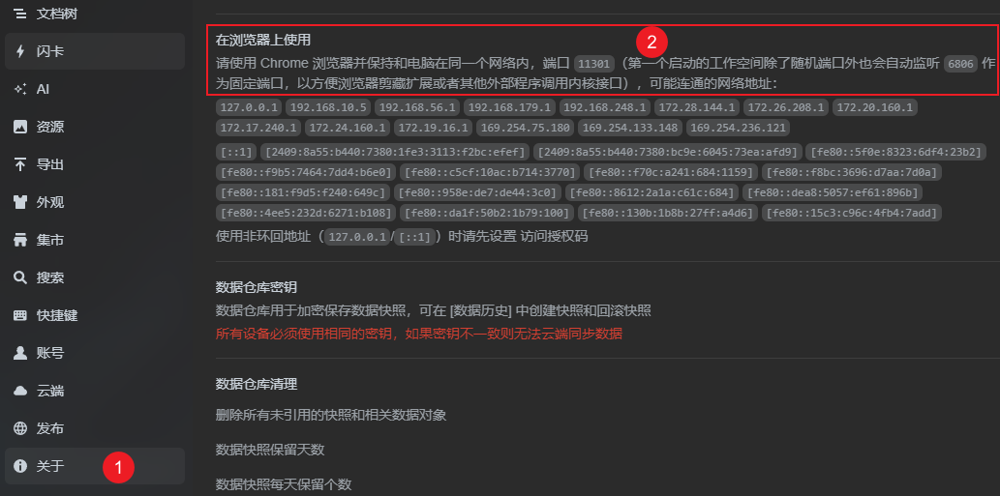
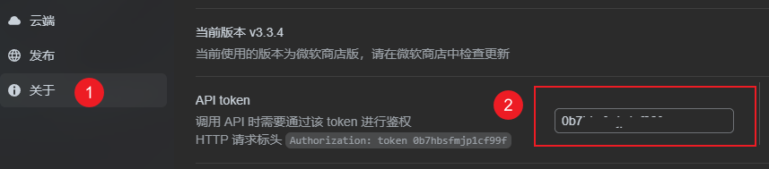

# SiYuan 笔记批量优化排版

这是一个用于批量处理思源笔记文档，自动优化排版的脚本工具。

通过 API 自动获取所有笔记本和文档 ID，并对每个文档执行排版优化操作。


## 1. 前言

我一直在电脑上做笔记，后来我学到了一个排版技巧：在中文和英文、数字之间加个空格，这样看起来更舒服。

直接看一个段落，没加空格 vs 加个空格：


不知道你喜欢哪种，我反正已经看惯了「加了空格」的，回不去了😂。

而我之前做的笔记，都是没有优化过排版的。

如果每篇笔记都逐个去优化排版，就太费时间了。

为此，就研究了下思源笔记内部的开发工具，然后用 AI 给出代码并运行，自动优化所有文章的排版，免得自己动手操作。


## 2. 实现思路

首先，思源笔记提供了开发工具，可以通过发送网络请求来进行一系列操作，例如：

- 查询所有笔记本
- 查询文档树（笔记本内的笔记结构）
- 创建笔记、删除笔记、修改笔记
- 排版优化
- ......

具体可以看思源官方的文档：[siyuan/API (opens new window)](https://github.com/siyuan-note/siyuan/blob/master/API_zh_CN.md)。


也就是说，通过这个工具，我们可以通过编程的方式来批量操作文档。

例如，想实现优化所有笔记的排版，可以：

- 先通过接口  `/api/notebook/lsNotebooks` 获取所有笔记本信息
- 对于每个笔记本，通过 `/api/filetree/listDocTree` 获取该笔记本的文档树（即所有文档的 ID）
- 将获取到的文档 ID 加入到一个集合中，然后分批处理文档


## 3. 实操

然后，我们就可以让 AI 给出代码和运行步骤即可。

实操步骤如下：环境准备 → 项目初始化 → 修改配置 → 运行


### 3.1 环境准备

为了简单，编程语言用的是 JS。

所以要安装 Node，官网：https://nodejs.org/zh-cn

下载 .msi 安装包，然后一路 next 即可。

然后 Win + R，输入 cmd 回车，打开命令行，输入：

```bash
npm config set registry https://registry.npmmirror.com
```

然后，Node 就完成安装和配置了。


### 3.2 项目初始化

下载代码后，在项目内打开命令行，输入如下命令：

```text
 npm install
```


### 3.3 修改配置

由于每个人的思源笔记地址、密钥都不一样，所以得修改下，改成自己的。

打开 `index.js`，修改这两处：

```JS
const BASE_URL = 'http://127.0.0.1:6806';    // 替换为你的实际地址（一般都是这个地址）
const AUTH_TOKEN = 'Token xxxxxx';           // xxxxxx 替换为你的实际 token
```


如何查看自己的地址和密钥呢？打开思源的设置（Alt + P），然后在「关于」里面找到地址：



Token：




### 3.4 运行

修改完文件后，就可以运行了。打开命令行，输入如下命令：

```
 node index.js
```


我设定了每优化 300 个文档，就会暂停 1 分钟，这是为了让思源笔记能更新下数据（我个人在使用过程中发现，当笔记过多时，频繁操作容易导致崩溃）。

你也可以自行修改每次优化的文档数量、暂停时间。

运行后，会在命令行输出日志，同时我也将日志导出到了项目内的 logs 文件夹下，感兴趣的可以看看。

然后静待项目运行完即可。

可以在控制台和日志文件（位于 `logs` 目录下）里确认执行情况。

